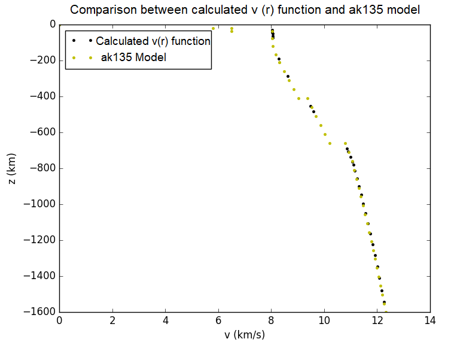
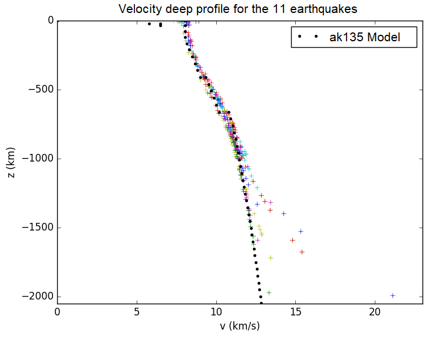

# Development of the Herglotz-Wiechert algorithm in Python

The development of the Herglotz-Wiecher algorithm was mainly done in Python. 

```python
import numpy as np
import matplotlib.pylab as plt
import math

B = np.loadtxt ('EV5.txt',float)
A = np.loadtxt ('modelo de terra.txt', float)

vmod = A[:,0]
zmod = -A[:,1]

#Receiving the columns from the file
#B[:,0] = B[:,0]*math.pi/180
delt=B[:,1]
t=B[:,0]

#Organizing the values
delt_arg = np.argsort(delt)

delt = delt[delt_arg]
t = t[delt_arg]

#print(delt[0], delt[len(delt)-1])

#interpolating
xvals=np.arange(delt[0],delt[len(delt)-1],1)
yinterp = np.interp(xvals, delt, t)
   

# Checking the interpolation
"""plt.plot(xvals,yinterp,'r.',delt,t,'b.')
plt.title('INTERPOLAÇÃO')
plt.show()"""

#transforming to rad delta
xvals = (xvals*math.pi)/180
    
#creating the radius parameter matrix

p = np.zeros(len(xvals))
for i in range(1,len(xvals)-1):

    p[i]=(yinterp[i+1]-yinterp[i-1])/((xvals[i+1]-xvals[i-1]))
    
p[0]=((yinterp[1]-yinterp[0])/(xvals[1]-xvals[0]))
p[36]=((yinterp[36]-yinterp[35])/(xvals[36]-xvals[35]))

#calculating r1 and v1

arcosh = np.zeros (len (p))
deltx=0.0174

z=np.zeros(len(p))
v=np.zeros(len(p))
for it in range(1,len(p)-1):
    ind = np.where(xvals == xvals[it])

    ide = ind[0]
    #print (ind)
    
    for i in range (0,len(p)):
        arcosh[i] = np.log((p[i]/p[ind])+ np.sqrt(((p[i]/p[ind])**2)-1))
    integral = 0.
    #retirando os nan's
    arcoshT = arcosh[ np.logical_not(np.isnan(arcosh))]
    
    for j in range (1,len(arcoshT)):
        integral+=(0.5*(arcoshT[j-1]+arcoshT[j])*deltx)
    
    ln_r0_r1 = integral /(np.pi)

    r0 = 6371

    ln_r1 = math.log(r0)-(ln_r0_r1)
       
    r1 = math.exp(ln_r1)

    v[it]=r1/p[ind]

    #print ('delta',xvals[it],'\nr1 =  ', r1, '\nv =  ',v)
    
    z[it]=-(r0-r1)

print (z)
print(v)
plt.plot(v,z,'k.', label="Dados Obtidos")
plt.plot(vmod,zmod,'y.',label="Modelo ak135")
plt.legend(loc='lower left')
plt.xlabel('v (km/s)')
plt.ylabel('z (Km)')
plt.xlim(5,13)
plt.ylim(-1100,0)
plt.title('Curva v(r) - TR 4')
plt.show()
```

The code's performance was evaluated through two numerical tests using synthetic data. The resulting inverted v(r) functions showed excellent agreement with the global ak135 velocity model used to generate the synthetic dataset.



The results from real data inversion showed that, for depths up to 1000 km, the v(r) functions are of excellent quality. For depths between 1000 and 2000 km, however, the results showed greater dispersion than expected. These results suggest that the methodology can reliably estimate P-wave velocity variation with depth within the continental lithosphere and upper mantle of Brazil.



I was very proud to defend this thesis, which was later presented at the Brazilian Geophysics Symposium.
[Click here to download the poster presented at the symposium.]


[Return to Homepage](./)

