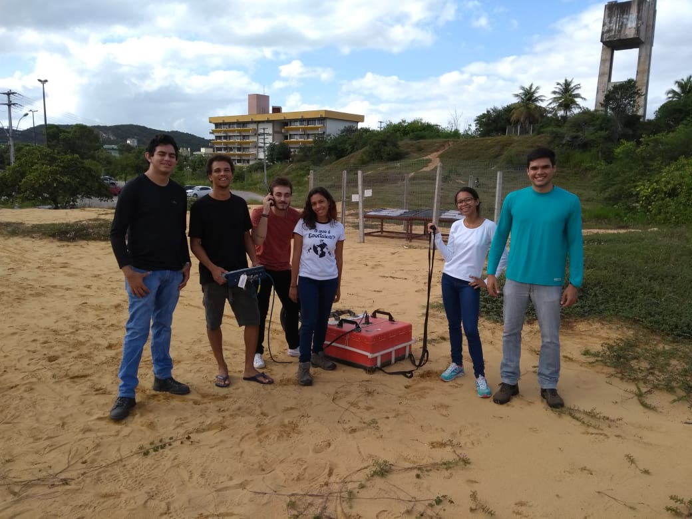
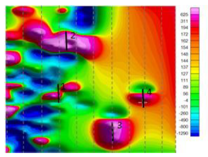

# Geophysical surveys

## GPR (Ground Penetrating Radar) Field Survey:
Conducted a Ground Penetrating Radar (GPR) survey to locate possible water and power lines beneath a site at the Federal University of Rio Grande do Norte. This project was carried out in collaboration with the university's infrastructure department as part of a preliminary site assessment before construction work began.

The processed data and interpretations are not publicly available.

<figure>
  
  <figcaption>On site with my classmates during our GPR fieldwork at UFRN.</figcaption>
</figure>

## Magnetometric Survey

This project was also conducted at the Federal University of Rio Grande do Norte. The goal was to carry out a magnetometric survey in a section of the campus to provide additional subsurface information to the university's infrastructure department.

<figure>
  
  <figcaption>Satellite image of the study area. The red square shows the boundaries of the region where the magnetometric survey was conducted..</figcaption>
</figure>

Before field data acquisition, we planned the survey by marking spatial reference points using **GPS data** and organizing the acquisition routine. In this study, we divided a 10x10 m area into imaginary lines spaced 1 meter apart. These lines guided the paths along which we carried the equipment.

<figure>
  
  <figcaption>GPS points plotted on the map. Figure 2: Acquisition plan layout.</figcaption>
</figure>

After field data collection, we used **Geosoft Oasis Montaj** for data processing. Through corrections and data manipulation, we generated a magnetometric anomaly map for the area, shown below. Four distinct anomaly profiles were identified and later associated with specific buried objects:
    • Profile 1 – Metal Pipe
    • Profile 2 – Metal Disc
    • Profile 3 – Cylinder
    • Profile 4 – Iron Hammer

<figure>
  
  <figcaption>Magnetometric anomaly profile map.</figcaption>
</figure>

## Gravimetric Map Generation

The objective of this project was to generate maps for two interconnected gravimetric profiles acquired in the northeastern region of Brazil. These profiles were collected in the field by professors from the Federal University of Rio Grande do Norte in collaboration with the Brazilian Mineral Resources Research Company (CPRM).

<figure>
  
  <figcaption>Geographic location of Profiles 1 and 2. Gravimetric stations are marked with stars.</figcaption>
</figure>

During the data processing stage, we used Microsoft Excel for reduction calculations required by this methodology. Geosoft Oasis Montaj was used to manipulate and visualize the maps. Below is an example of an Excel table showing the calculations performed for Profile 1. The same process was applied to Profile 2.

<figure>
  
  <figcaption>Excel table showing anomaly calculations and corrections for Profile 1.</figcaption>
</figure>

After data processing, a Bouguer anomaly map was created using Geosoft.
By comparing the Bouguer anomaly map with the geological map of the region, we observed a good correlation. From bottom to top, the Bouguer map begins with a lower density contrast (blue tones), which corresponds on the geological map to orthogneiss and paragneiss formations (highlighted in pink). The green tones on the Bouguer map are associated with alluvial deposits, showing slightly higher density contrasts. The yellow tones correspond to an intrusive suite composed of biotite granites, and finally, the warmer colors reflect a second intrusive suite made up of granites with a high feldspar content, explaining the higher densities.

<figure>
  
  <figcaption>Left: Bouguer anomaly map with stations marked as circles. Right: Geological map of the region..</figcaption>
</figure>

## Undergraduate Thesis

In the final year of my undergraduate studies, I worked on my thesis project, which aimed to validate, through practical application to real data, a well-established methodology in seismology known as the Herglotz-Wiechert inversion. Below is a brief summary of the project:

## EVALUATION OF THE HERGLOTZ-WIECHERT INVERSION USING P-WAVE TRAVEL TIMES FROM THE BRAZILIAN SEISMOGRAPHIC NETWORK
The Herglotz-Wiechert method, developed in 1910 by Gustav Herglotz and Emil Wiechert, is based on the analytical inversion of seismic travel times to determine how seismic velocity varies with depth. The observational data consist of T–Δ curves, where T is the travel time in seconds and Δ is the epicentral distance in radians.
The goal of this work was to develop a computational code implementing the inversion method and to evaluate its performance by measuring and inverting P-wave travel times for 11 earthquakes recorded at 31 seismic stations of the Brazilian Seismographic Network (RSB).

<figure>
  
  <figcaption>Geographic location of the 11 selected earthquakes and the 31 seismic stations..</figcaption>
</figure>

The mathematical equations were coded using Python, while travel times and epicentral distances were obtained by picking P-wave arrival times with the Seismic Analysis Code (SAC), you can read about the code and results [here](HW.html).

[Return to Homepage](./)
